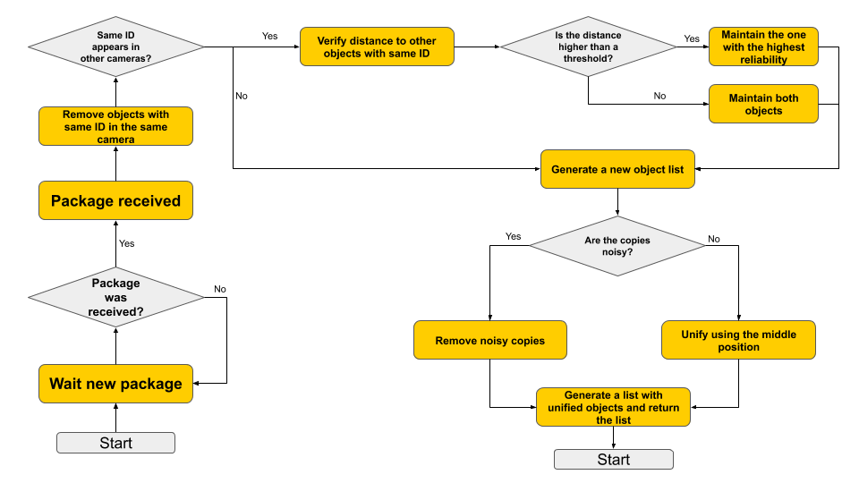
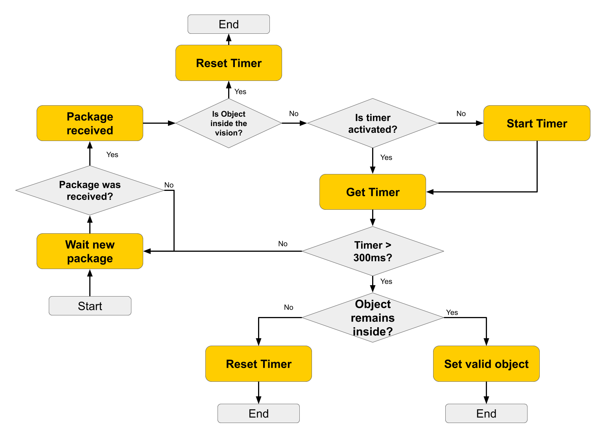
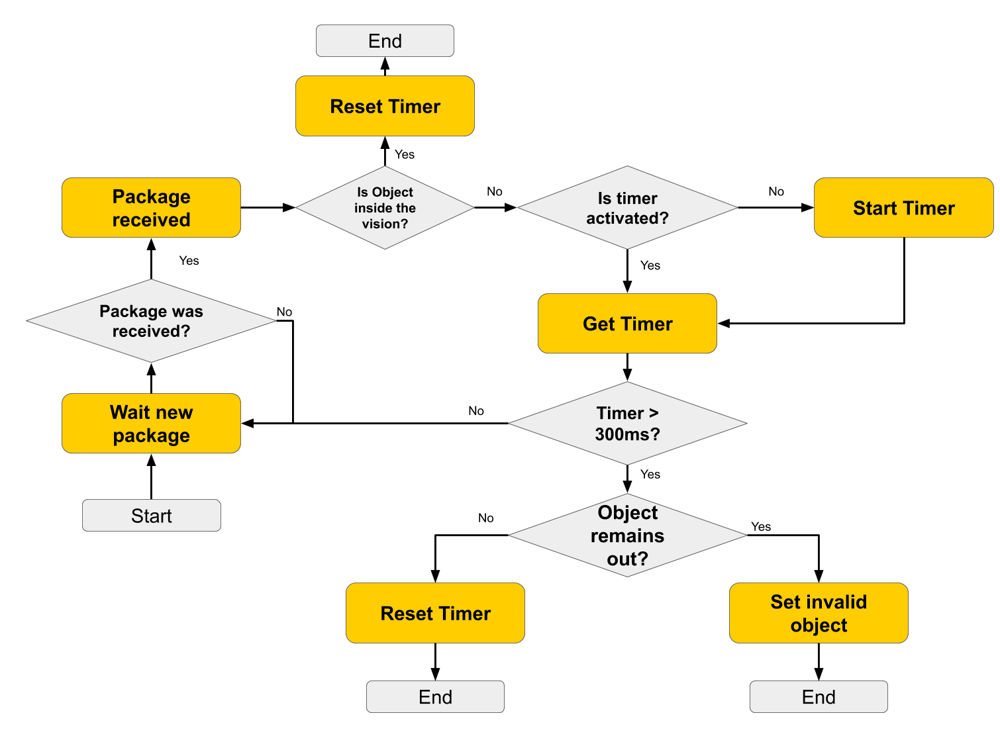
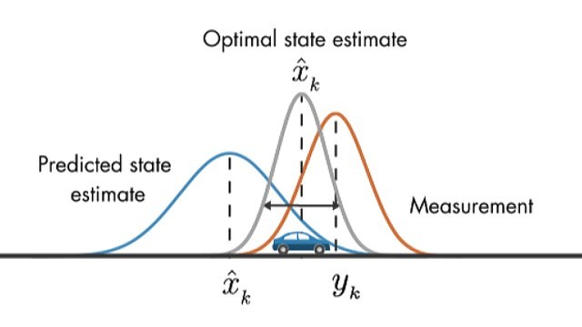
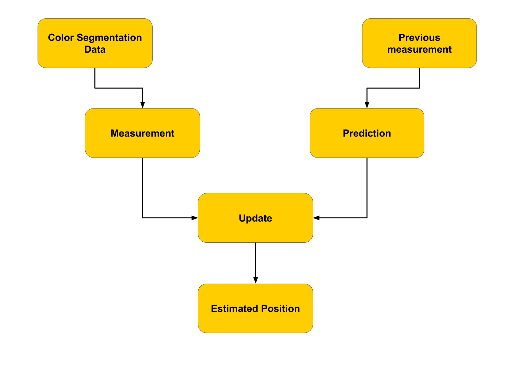

# Filters to Vision System

Robots blinking on vision system and ghost robots being identified by vision are the commonly problems in many vision systems with focus in robotics. When this problems arrises in competitions or critical systems, a robotic agent control failure may happen. 

As a solution to these problems, some filters can be applied to guarantee the persistence of objects in the environment or to create resistance to new objects. However, only these filters are not enough and others with statistical or inertial approach are needed to ensure the consistency of the temporal information of objects, such as a Kalman filter.

For effect of all explanations in this tutorial we will supose the existence of a information package containg all localization information about each player or ball.

## Multi-Object Filter

The mainly purpose of a Multi-Object is avoid multiple objects with the same ID being tracked by the vision system. This is a commonly problem when the system uses more than one camera or the color segmentation creates more than one object to the same color pattern. So, the real application of this filter is unify objects with same ID.

## Noise Filter

The Noise Filter aims to avoid "ghost objects" which can appear due problems in color segmentation. This filter presents a resistence to new objects, maintaining the map with same quantity of objects.

To implement this filter, it is possible to use a timer, verifying if the object cotinue existing after a time window. Other aproach uses a counter and every frame where the object appears, one point is added to a confidency counter.

## Loss Filter

The Loss Filter aims to avoid deactivate objects which desappear during small amount of thime due problems in color segmentation caused by shadows or light modification. This filter presents a persistence to objects that already exists in the system. With him, even if an object disappears, it is possible to continue tracking its position using the Kalman Filter.

## Kalman Filter

Kalman filters are used to provide information where the data acquisition through sensors presents difficulties such as noises, instability or acess. To solve this, it is possible to use indirect measurements associated with mathematical models to estimate an optimal value. An example of its use is the estimation of the position of objects in a given space, as can be seen in the image below, as we used in this project.

In this case, the Kalman Filter acts to predict the movement of objects by combining the measured data (received from segmentation) with the calculated location based on physical displacement equations. The filter's output is precisely the combination of these two possibilities, pointing out a more probably location for the object.

Libraries such as OpenCV and Eigen provides implementation to Kalman Filter, but they are very large to insert into a project only to use a single item. A C++ implementation made by Warthog Robotics and adapted by Maracatronics Team can be found [here](https://github.com/maracatronics/Armorial-Carrero/tree/master/KalmanFilter).

A very nice explanation can be found [here](https://towardsdatascience.com/sensor-fusion-part-1-kalman-filter-basics-4692a653a74c).